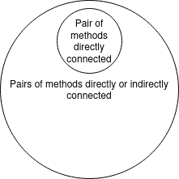

# TCC *vs* LCC

Explain under which circumstances *Tight Class Cohesion* (TCC) and *Loose Class Cohesion* (LCC) metrics produce the same value for a given Java class. Build an example of such as class and include the code below or find one example in an open-source project from Github and include the link to the class below. Could LCC be lower than TCC for any given class? Explain.

A refresher on TCC and LCC is available in the [course notes](https://oscarlvp.github.io/vandv-classes/#cohesion-graph).

## Answer

When all the methods are directly connected, the TCC and the LCC have the same value. In the following example, TCC = 1/1 and LCC = 1/1.

```java
public class My {
        
    private int name = 5;
    
    public void is() {
        System.out.print(name);
    }

    public void jeff() {
        System.out.println(name);
    }
}
```

LCC cannot be lower than TCC, because the number of directly connected nodes has to be included in or equal to the number of directly or transitively connected nodes.

